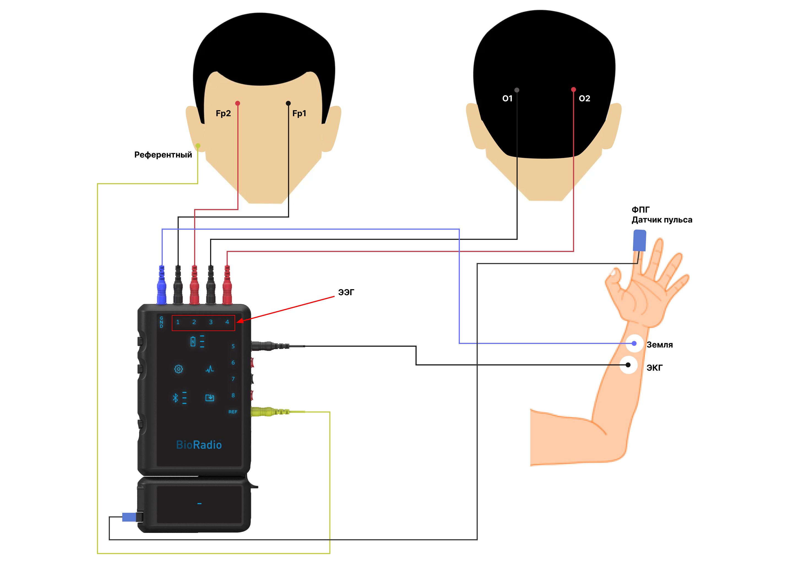
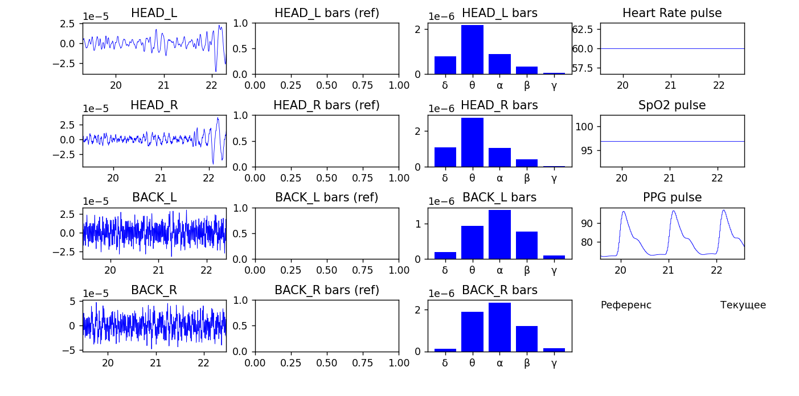
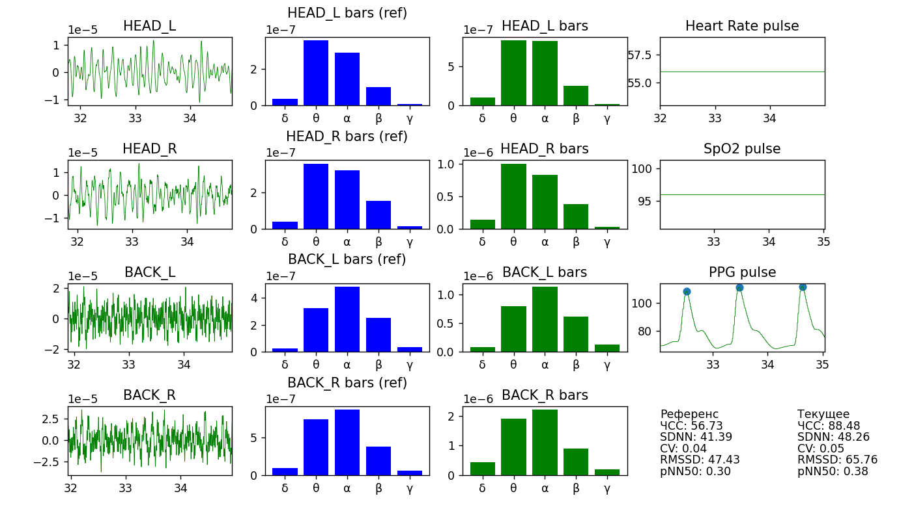
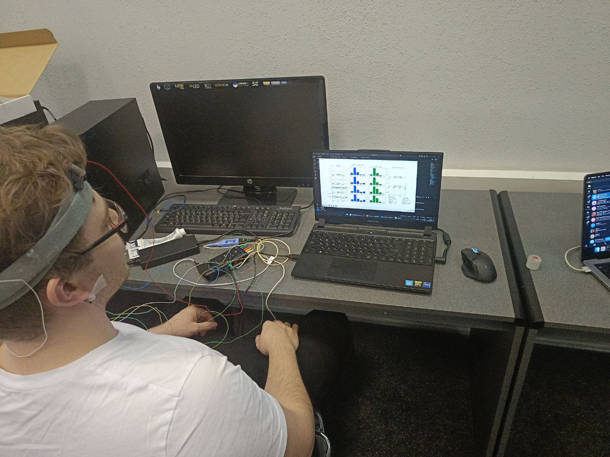
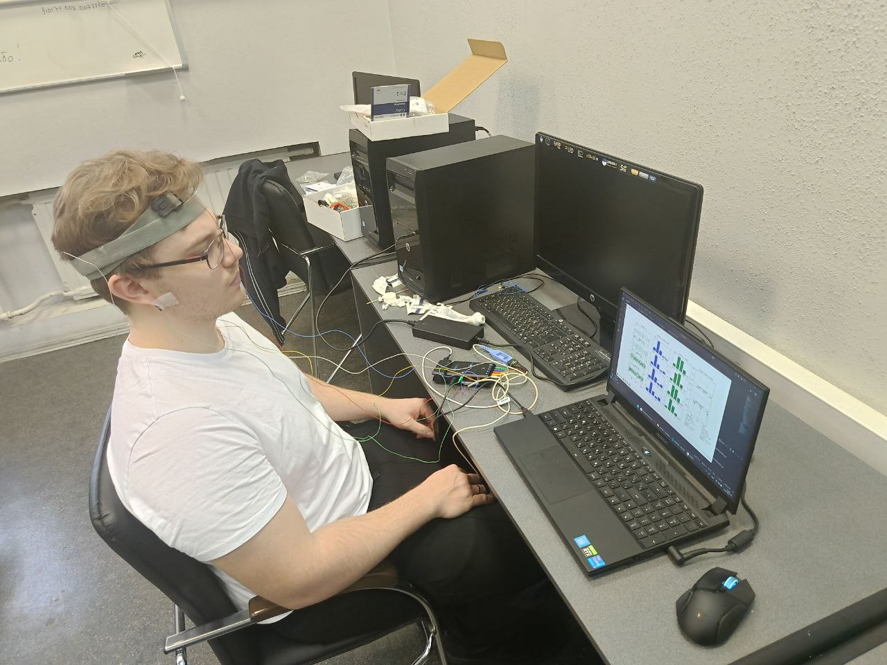
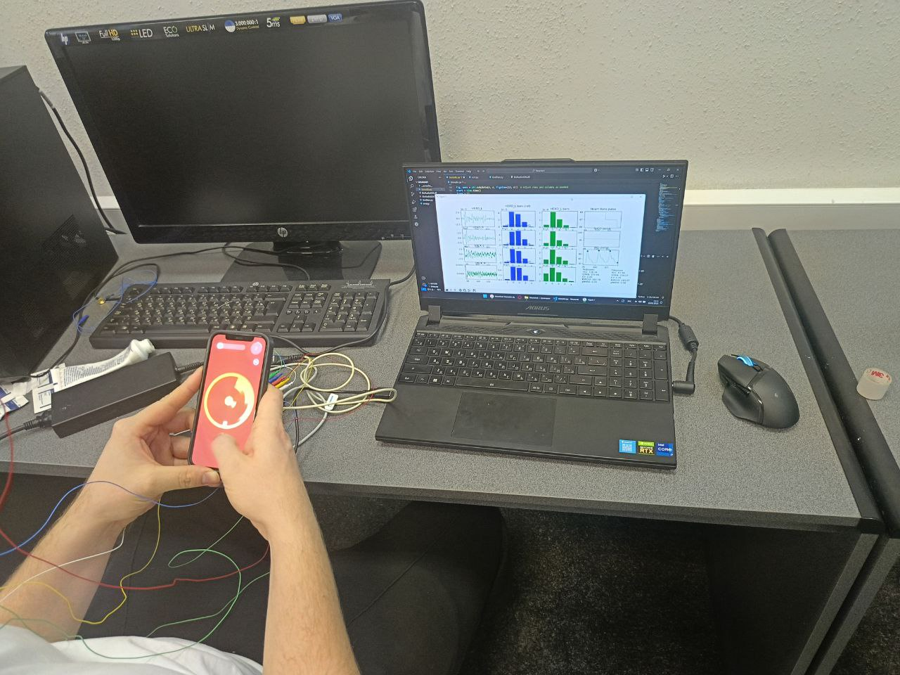

# Отчет по разработке программного обеспечения для анализа показателей утомляемости человека
## Университет ИТМО
### Дисциплина: Пути развития национальной технологической инициативы Нейронет

## Содержание
1. Введение
2. Описание проекта
3. Методология
4. Техническая реализация
5. Результаты
6. Заключение

## 1. Введение

В рамках данного проекта была разработана система анализа психофизиологического состояния человека с использованием оборудования BioRadio. Основной целью являлось создание программного обеспечения для оценки уровня утомляемости на основе ЭЭГ и пульсометрии.

## 2. Описание проекта

Проект направлен на решение следующих задач:
- Получение данных с устройства BioRadio
- Обработка и фильтрация биосигналов
- Анализ ритмов ЭЭГ (δ, θ, α, β, γ)
- Расчет показателей вариабельности сердечного ритма
- Визуализация данных в реальном времени

## 3. Методология

### 3.1 Используемое оборудование
- BioRadio - устройство для регистрации биосигналов
- 4 ЭЭГ-электрода (HEAD_R, HEAD_L, BACK_L, BACK_R)
- Датчик пульса

### 3.2 Анализируемые показатели
- Ритмы ЭЭГ:
  - δ (1-4 Гц)
  - θ (4-8 Гц)
  - α (8-14 Гц)
  - β (14-30 Гц)
  - γ (30-40 Гц)
- Показатели ВСР:
  - SDNN
  - CV
  - RMSSD
  - pNN50
  - ЧСС

### 3.3 Процедура исследования
- Калибровка оборудования перед каждым измерением
- Размещение электродов согласно международной системе 10-20
- Период адаптации испытуемого - 5 минут
- Запись референсных значений в состоянии покоя - 30 секунд
- Основной период измерений - до 30 минут



## 4. Техническая реализация

### 4.1 Инициализация устройства

Подключение к устройству BioRadio реализовано следующим образом:

Инициализация и подключение к устройству


```
device_manager = BioRadioDeviceManager()
devices = device_manager.DiscoverBluetoothDevices()
device = device_manager.GetBluetoothDevice(int(device_info.MacId, 16))
device.Connect()
device.StartAcquisition()
```


### 4.2 Фильтрация сигналов

Для фильтрации ЭЭГ сигналов реализован класс LiveLFilter:

```
class LiveLFilter:
    def __init__(self, b, a):
        self.b = b
        self.a = a
        self._xs = deque([0] * len(b), maxlen=len(b))
        self._ys = deque([0] * (len(a) - 1), maxlen=len(a)-1)

    def __call__(self, x):
        self._xs.appendleft(x)
        y = (np.dot(self.b, self._xs) - np.dot(self.a[1:], self._ys)) / self.a[0]
        self._ys.appendleft(y)
        return y
```


### 4.3 Анализ ритмов ЭЭГ

Для анализа ритмов ЭЭГ используется преобразование Фурье и расчет средних амплитуд в соответствующих частотных диапазонах:

```
def fourie(time, sig):
    t = [t - time[0] for t in time]
    T = 1 / 500
    N = int(max(t) / T)
    linTime = np.linspace(0, max(t), N)
    x = rfftfreq(N, T)[1 : int(N // 2)]
    inter_sig = interp1d(t, sig, kind='cubic', fill_value='extrapolate')(linTime)
    y = 2 / N * np.abs(rfft(inter_sig)[1 : int(N // 2)])
    return x, y
```


### 4.4 Анализ вариабельности сердечного ритма

Расчет показателей ВСР производится на основе RR-интервалов:

```
N = len(rr)
M = np.mean(rr)
SDNN = (sum([(i-M)2 for i in rr])/(N-1))0.5
CV = SDNN/M
RMSSD = (sum([(rr[i]-rr[i+1])2 for i in range(N-1)])/(N-1))0.5
pNN50 = sum([(1 if abs(rr[i]-rr[i+1])>50 else 0) for i in range(N-1)])/(N-1)
```

### 4.5 Визуализация данных

Интерфейс программы разделен на несколько информационных блоков:
- Графики ЭЭГ в реальном времени для каждого канала
- Спектральный анализ ритмов для каждого отведения
- Сравнение текущих показателей с референсными значениями
- Панель мониторинга ВСР



### 4.6 Алгоритм определения утомления

Система определяет наступление утомления по следующим критериям:
- Увеличение мощности тета-ритма более чем на 30% от референсного значения
- Снижение альфа-активности
- Увеличение показателя SDNN более чем на 40%
- Снижение ЧСС относительно референсного значения



## 5. Результаты

В ходе тестирования системы были получены следующие результаты:

1. Успешно реализовано получение данных с устройства BioRadio
2. Разработана система фильтрации и анализа ЭЭГ сигналов
3. Реализован расчет показателей ВСР в реальном времени
4. Создан интерфейс визуализации данных с возможностью сравнения текущих показателей с референсными значениями

[Здесь необходимо добавить фотографии испытуемого и скриншоты интерфейса программы]


## 6. Заключение

Разработанное программное обеспечение позволяет:
- Проводить мониторинг психофизиологического состояния в реальном времени
- Анализировать динамику изменения показателей ЭЭГ и ВСР
- Выявлять признаки утомления на основе отклонения показателей от референсных значений

Система может быть использована для:
- Контроля состояния операторов
- Исследования утомляемости
- Оценки эффективности отдыха

### Преподаватель: Билый Андрей Михайлович
Доцент, доктор медицинских наук

### 6.1 Перспективы развития

Планируемые улучшения системы:
- Внедрение алгоритмов машинного обучения для повышения точности
- Разработка мобильного приложения для удаленного мониторинга
- Интеграция с другими биометрическими датчиками
- Создание облачной системы хранения и анализа данных

### 6.2 Практическое применение




_Санкт-Петербург, 2025_
